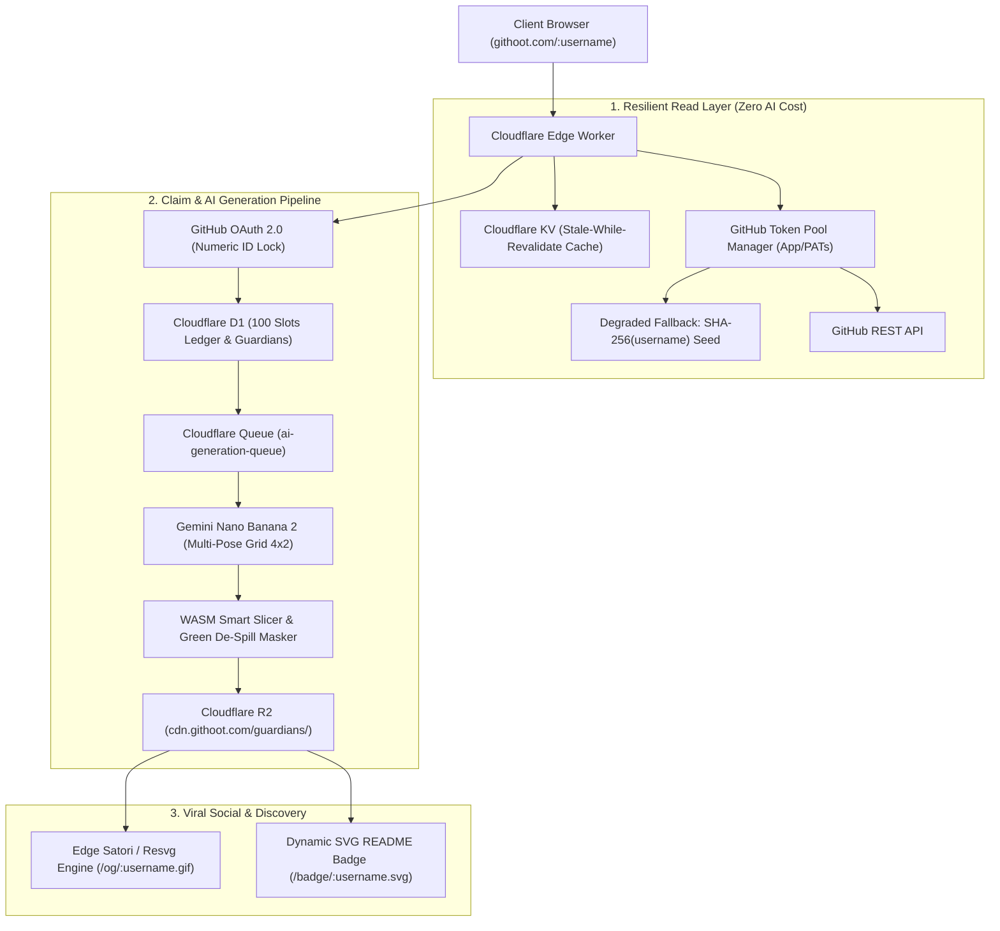

# GitHoot System Architecture & Technical Specifications

## 1. Architectural Philosophy

GitHoot is designed as an **Edge-First Serverless Application** deployed on Cloudflare. It separates high-volume read traffic (public egg previews) from asynchronous, expensive write workflows (GitHub OAuth, AI image generation, asset post-processing).

---

## 2. Infrastructure & Cloudflare Components



---

## 3. Data Schema & Core Tables (Cloudflare D1 SQLite)

```sql
-- users table
CREATE TABLE users (
    id TEXT PRIMARY KEY,
    github_user_id INTEGER UNIQUE NOT NULL,
    status TEXT DEFAULT 'active',
    created_at INTEGER NOT NULL,
    updated_at INTEGER NOT NULL
);

-- github_accounts table
CREATE TABLE github_accounts (
    id TEXT PRIMARY KEY,
    user_id TEXT REFERENCES users(id),
    github_user_id INTEGER UNIQUE NOT NULL,
    login TEXT NOT NULL,
    avatar_url TEXT,
    name TEXT,
    bio TEXT,
    public_repos INTEGER DEFAULT 0,
    followers INTEGER DEFAULT 0,
    total_stars INTEGER DEFAULT 0,
    top_languages TEXT, -- JSON
    claimed_at INTEGER,
    last_synced_at INTEGER NOT NULL
);

-- guardians table
CREATE TABLE guardians (
    id TEXT PRIMARY KEY,
    user_id TEXT NOT NULL REFERENCES users(id),
    github_user_id INTEGER UNIQUE NOT NULL,
    name TEXT NOT NULL,
    egg_type TEXT NOT NULL,
    species TEXT NOT NULL,
    element TEXT NOT NULL,
    dna_seed TEXT NOT NULL,
    rarity_tier TEXT NOT NULL, -- Common, Rare, Epic, Legendary, Mythic
    hero_image_url TEXT NOT NULL,
    spritesheet_url TEXT,
    traits TEXT NOT NULL, -- JSON
    level INTEGER DEFAULT 1,
    experience INTEGER DEFAULT 0,
    energy_state TEXT DEFAULT 'Active',
    created_at INTEGER NOT NULL
);

-- early_access_slots table (100 slots ledger)
CREATE TABLE early_access_slots (
    slot_number INTEGER PRIMARY KEY, -- 1 to 100
    github_user_id INTEGER UNIQUE,
    claimed_at INTEGER,
    status TEXT DEFAULT 'available' -- available, claimed
);
```

---

## 4. AI Spritesheet & Alpha Normalization Pipeline

1. **Gemini Nano Banana 2 API Call:** Emits structured 4x2 matrix containing canonical Hero portrait and 7 poses (Idle, Happy, Sleepy, Proud, Angry, Work/Coding, Celebrate) on pure `#00FF00` chroma background.
2. **WASM Connected Component Slicer:** Detects actual character contours, computes center-of-mass, and pads each sprite into standardized `256 x 256 px` frames.
3. **Green De-Spill & Alpha Feathering:** Replaces green pixels and filters green color fringes on hair/edges to produce clean transparent WebP assets.
4. **R2 Distribution:** Uploads `hero.webp` and `spritesheet.webp` to `cdn.githoot.com/guardians/{id}/`.
