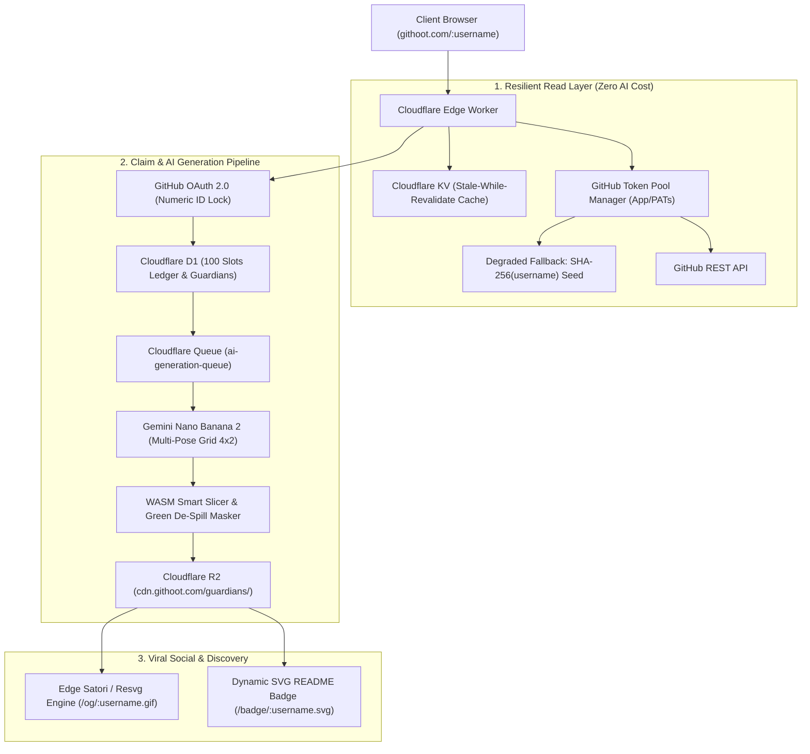

# GitHoot System Architecture & Technical Specifications

## 1. Architectural Philosophy

GitHoot is designed as an **Edge-First Serverless Application** deployed on Cloudflare. It separates high-volume read traffic (public egg previews) from asynchronous, expensive write workflows (GitHub OAuth, AI image generation, asset post-processing).

---

## 2. Infrastructure & Cloudflare Components



---

## 3. Data Schema & Core Tables (Cloudflare D1 SQLite)

```sql
-- users table
CREATE TABLE users (
    id TEXT PRIMARY KEY,
    github_user_id INTEGER UNIQUE NOT NULL,
    status TEXT DEFAULT 'active',
    created_at INTEGER NOT NULL,
    updated_at INTEGER NOT NULL
);

-- github_accounts table
CREATE TABLE github_accounts (
    id TEXT PRIMARY KEY,
    user_id TEXT REFERENCES users(id),
    github_user_id INTEGER UNIQUE NOT NULL,
    login TEXT NOT NULL,
    avatar_url TEXT,
    name TEXT,
    bio TEXT,
    public_repos INTEGER DEFAULT 0,
    followers INTEGER DEFAULT 0,
    total_stars INTEGER DEFAULT 0,
    top_languages TEXT, -- JSON
    claimed_at INTEGER,
    last_synced_at INTEGER NOT NULL
);

-- guardians table
CREATE TABLE guardians (
    id TEXT PRIMARY KEY,
    user_id TEXT NOT NULL REFERENCES users(id),
    github_user_id INTEGER UNIQUE NOT NULL,
    name TEXT NOT NULL,
    egg_type TEXT NOT NULL,
    species TEXT NOT NULL,
    element TEXT NOT NULL,
    dna_seed TEXT NOT NULL,
    rarity_tier TEXT NOT NULL, -- Common, Rare, Epic, Legendary, Mythic
    hero_image_url TEXT NOT NULL,
    spritesheet_url TEXT,
    traits TEXT NOT NULL, -- JSON
    level INTEGER DEFAULT 1,
    experience INTEGER DEFAULT 0,
    energy_state TEXT DEFAULT 'Active',
    created_at INTEGER NOT NULL
);

-- early_access_slots table (100 slots ledger)
CREATE TABLE early_access_slots (
    slot_number INTEGER PRIMARY KEY, -- 1 to 100
    github_user_id INTEGER UNIQUE,
    claimed_at INTEGER,
    status TEXT DEFAULT 'available' -- available, claimed
);
```

---

## 4. Single-Subject Frame Generation & Fail-Closed Image Acceptance Gate

Per binding `AGENTS.md` Invariant #4, generation executes **one pose per API call** on solid `#00FF00` chroma background, compositing multi-pose spritesheets locally. Every rendered frame passes through the single authoritative gate `validateAndNormalizeFrame` (`src/server/services/image/frame-gate.ts`):

1. **Dimension Contract & Binary Validation:** Verifies PNG magic `[0x89, 0x50, 0x4E, 0x47, 0x0D, 0x0A, 0x1A, 0x0A]`, structural IHDR decoding (8-bit depth, non-interlaced, RGBA/RGB color types only, chunk CRC-32 integrity), rejecting JPEG, interlaced, truncated, or oversized (`>1024`px / `>4MB`) inputs.
2. **Green De-Spill Chroma Removal:** Applies in-place green de-spill ($g = \min(g, (r+b)/2)$) and alpha feathering (`chroma-removal.ts`).
3. **Contour Detection & Quality Gates (`GATES` from `dna/contracts.ts`):**
   - **Transparent Frame Gate:** Rejects 100% transparent / empty outputs (`width === 0 || height === 0`).
   - **Fill Ratio Gate:** Rejects subjects where bounding box area $< 6\%$ of frame area (`minBboxFill = 0.06`).
   - **Aspect Ratio Gate:** Rejects strip/banner shapes where width/height $> 3.2$ (`maxBboxAspect = 3.2`).
   - **Collage Echo Gate:** 8-neighbour connected component labeling (`analyzeConnectedComponents`) rejects $> 4$ large components (`maxLargeComponents = 4`).
   - **Multi-Subject Gate:** Rejects frames where the second largest component is $> 30\%$ area of the main component (`dominanceRatio = 0.30`).
4. **Aspect-Preserving Scale-To-Fit & Centering:** Scales bounding boxes up to $1024 \times 1024$ into target $256 \times 256$ canvas preserving aspect ratio without blind cropping (`scale-to-fit.ts`).
5. **Raw Gate Input Retention:** Exact pre-normalization bytes are persisted at `guardians/{id}/raw/{rawSha256}.png` for cryptographic audit and P5 preflight reproduction.
6. **Mandatory Canonical Reference & Cached Frame Re-Validation:** Identity-bound poses strictly require approved canonical reference bytes (`references/{sha}.png`); cached frames in R2 are re-validated through the gate before compositing.

---

## 5. Authentic Telemetry, Provenance Schema & Deterministic Identity

### 5.1 Telemetry Snapshot & Strict Provenance
Every companion generation consumes an authentic `TelemetrySnapshot` where every individual metric carries an explicit provenance tag (`measured` | `unavailable`). Unmeasured fields are never represented as measured zeros.

```typescript
export type MetricProvenance = 'measured' | 'unavailable';

export interface TelemetrySnapshot {
  topLanguages: string[];
  stars: number;
  forks: number;
  publicRepos: number;
  followers: number;
  accountAgeYears: number;
  mergedExternalPRs: number;
  releases: number;
  reviewRatio: number;
  collaborators: number;
  activeWeeks: number;
  nightCommitRatio: number;
  provenance: Record<keyof Omit<TelemetrySnapshot, 'provenance'>, MetricProvenance>;
}
```

### 5.2 Deterministic Merit Scoring & Neutral Baseline
- When a metric is tagged `unavailable`, the merit scoring engine assigns a documented neutral baseline ($0.25$) rather than penalizing the user with a measured zero.
- 1 GitHub User ID $\to$ 1 immutable `dnaSeed` derived via single-source FIPS 180-4 SHA-256 (`crypto.subtle.digest` / `sha256Hex`).

### 5.3 Fail-Closed Identity Validation (Blocker #11c Resolution)
- The background Queue Consumer Worker strictly reads the persisted `identity_spec` written at claim time.
- If `identity_spec` is missing or invalid, the worker immediately fails closed, updates the guardian and hatch job state to `QUARANTINED`, and acknowledges the queue message. Ad-hoc default identity synthesis in background workers is strictly forbidden.

---

## 6. Resumable Per-Pose Queue DAG, Single-Flight Outbox & Crash-Consistent Budget Ledger

### 6.1 Versioned Discriminated Union Queue Messages
Queue envelopes are strictly validated against a versioned discriminated union (`src/server/queue/message-schema.ts`):
1. `{ v: 1, type: 'HATCH_REFERENCE', jobId, guardianId }`: Generates reference candidate and stages in `VERIFYING`.
2. `{ v: 1, type: 'HATCH_POSE', jobId, guardianId, poseId, attempt }`: Generates one single-subject pose under conditional lease.
3. `{ v: 1, type: 'HATCH_COMPOSITE', jobId, guardianId }`: Verifies all 16 frames, composites master assets, and uploads manifest.
4. `{ v: 1, type: 'REVALIDATE_PROFILE', username }`: Clears profile KV cache.

Malformed or unknown-version payloads fail closed into `guardian_dlq_quarantine` and call `retry()` to trigger Cloudflare Queues DLQ routing.

### 6.2 Per-Pose Conditional Leases & Single-Winner Partial Unique Index
- Attempts are tracked in `guardian_pose_attempts` with deterministic claim key `job_id:pose_id:attempt_number`.
- Leases are acquired conditionally (`WHERE state = 'LEASED' AND lease_expires_at > now`).
- Invariant: exactly one accepted attempt row is allowed per `(job_id, pose_id)` via:
  `CREATE UNIQUE INDEX idx_pose_attempts_accepted ON guardian_pose_attempts(job_id, pose_id) WHERE state = 'ACCEPTED';`

### 6.3 Crash-Consistent Atomic Batch Commit
All 5 database mutations on pose success execute in a single `env.DB.batch([ ... ])` transaction with mandatory lease-ownership guards:
1. `INSERT INTO guardian_hatch_frames ... WHERE EXISTS (SELECT 1 FROM guardian_pose_attempts WHERE ... lease_owner = ? AND state = 'LEASED')`
2. `UPDATE guardian_budget_reservations SET state = 'COMMITTED' ... WHERE EXISTS (...)`
3. `UPDATE guardian_hatch_jobs SET reserved_cents = MAX(0, reserved_cents - 25), spent_cents = spent_cents + 25 ... WHERE EXISTS (...)`
4. `UPDATE ai_budget_ledger SET reserved_cents = MAX(0, reserved_cents - 25), settled_cents = settled_cents + 25 ... WHERE EXISTS (...)`
5. `UPDATE guardian_pose_attempts SET state = 'ACCEPTED' ... WHERE lease_owner = ? AND state = 'LEASED'`

If a stale worker loses ownership during an API call, all 5 statements evaluate to 0 changes, preventing duplicate writes or budget corruption.

### 6.4 Transactional Outbox & At-Least-Once Bounded Delivery
- State changes (claim, reference approval) write intended queue messages to `guardian_outbox` in the same atomic transaction as business records.
- `drainOutbox` atomically acquires row leases (`lease_owner`, `lease_expires_at`) before sending, minimizing duplicate queue emissions across concurrent Cron instances.
- Per Cloudflare Queues semantics, crash-after-send before mark legitimately redelivers. Downstream consumers converge idempotently to a single accepted row via the deterministic claim key `(job_id, pose_id, attempt_number)` and partial unique accepted index.
- Missing `AI_QUEUE` bindings fail closed, triggering exponential backoff and poison recording rather than faking delivery.
### 6.5 Atomic Budget Reservation & Sweeper
- Enforces worst-case $0.25/attempt reservation before calling Gemini.
- Enforces per-job ($5.00) and daily ($20.00) hard spend caps atomically.
- `reconcileAbandonedReservations` reconciles reservations older than 30 minutes from crashed workers and restores daily budget limits.

---

## 7. Atomic Publication Integrity & Single D1 Pointer CAS

### 7.1 Content-Addressed Masters & Immutable Manifest
- Master spritesheets, strips, and manifest JSON are stored at immutable content-addressed keys:
  - `masters/<sheetPngSha>.png` / `masters/<sheetWebpSha>.webp`
  - `masters/<stripPngSha>.png` / `masters/<stripWebpSha>.webp`
  - `manifests/<manifestSha>.json`
- Manifest files are strictly validated (`GuardianManifest` schema) carrying `state: 'ASSET_READY'`, `identityHash`, and digests for all 16 frames and 4 master artifacts.

### 7.2 Cryptographic Byte-Digest & Cross-Field Agreement Preflight
Before publication approval, `verifyPublicationReady` executes a strict non-sampling preflight gate:
1. **Byte Digest Recomputation:** Computes real binary SHA-256 over all 16 raw frames, 16 normalized frames, 4 master artifacts, and the manifest in R2.
2. **Phase 3 Gate Re-Execution:** Re-runs the TS contour extraction over every raw frame byte buffer, verifying that it passes all `AGENTS.md:46` quality thresholds and reproduces the exact `frame_sha256`.
3. **Cross-Field Agreement:** Validates agreement between D1 `guardians.reference_sha256`, `guardian_reference_candidates.candidate_sha256`, and `manifest.referenceSha256`, as well as `identityHash` and `modelId`.
4. **Hash-Bound Semantic Verdicts:** Verifies all 16 frames have an attached semantic review verdict with `verdict === 'pass'` bound to the frame's `frame_sha256`.

### 7.3 Single-Row D1 Pointer Winner Election CAS
- Publication decision is executed as an authoritative single-row insert into `guardian_publication`:
  `INSERT INTO guardian_publication (guardian_id, job_id, manifest_sha256, manifest_key, spritesheet_sha256, spritesheet_key, state, reviewer, published_at, created_at) VALUES (...);`
- Because `guardian_id` is the PRIMARY KEY, concurrent reviewers racing to publish immediately trigger a unique constraint violation; the loser receives a truthful `CONFLICT` response without corrupting visible state.
- Re-publishing an already published guardian is idempotent and returns the active `ASSET_READY` manifest pointer.

### 7.4 Post-CAS Idempotent Projections
- After the CAS wins, `guardians.status` and `guardian_hatch_jobs.state` are updated as idempotent projections of the pointer row.
- If a worker crashes between CAS and projection, public readers resolving via `guardian_publication` still see `ASSET_READY` with the immutable content-addressed manifest, and subsequent requests safely reconcile the projections.

---

## 8. Reviewer Authorization & Provenance-Bound Review Surface

### 8.1 Dual-Auth Cryptographic Model
Admin and reviewer endpoints enforce `verifyReviewerAuthorization`:
1. **Cloudflare Access RS256 JWT Assertion (`Cf-Access-Jwt-Assertion`):** Primary production path. Validates RS256 signature against team JWKS, matching audience (`CF_ACCESS_AUD`), valid team issuer (`https://<team>.cloudflareaccess.com`), unexpired `exp`, and active `nbf`.
2. **Dedicated Admin Bearer Secret (`Authorization: Bearer <ADMIN_REVIEW_SECRET>`):** Service/fallback path. Strictly uses `ADMIN_REVIEW_SECRET` ($\ge 16$ bytes) compared via `constantTimeEqual` to prevent timing attacks. Reusing `AUTH_SECRET` (OAuth state secret) is rejected.

### 8.2 In-Flight Coalesced Dynamic JWKS Rotation
- Statically configured `CF_ACCESS_JWKS` acts as an initial cache seed.
- When a JWT arrives with an unknown `kid` (from live Cloudflare key rotation), `fetchTeamJwks(..., forceRefresh=true)` bypasses memory/KV caches, coalesces concurrent in-flight fetches via a shared Promise, and updates the cache.
- If the rotated key is absent from the live team certs endpoint, it is negative-cached for 5 seconds to prevent refresh-amplification DoS floods.

### 8.3 Server-Derived Identity Hash Provenance
- Reference approval and publication gates cryptographically recompute and validate `identityHash` server-side from `guardians.identity_spec` in D1 using `validateIdentitySpec`.
- Caller-supplied `currentIdentityHash` values in request bodies are ignored.

### 8.4 Named In-Repo Review Surface (`GET/POST /auth/admin/review/:jobId`)
- **`GET /auth/admin/review/:jobId`:** Assembles the complete immutable review bundle (16 candidate frames + reference image with content-addressed URLs and SHA-256 digests) and computes canonical `bundleSha = sha256Hex(canonicalJson(bundleData))` while the job is in `VERIFYING`.
- **`POST /auth/admin/review/:jobId`:** Requires `{ decision: 'approve' | 'reject', bundleSha }`. Recomputes `currentBundleSha` from live D1/R2 state; any mismatch rejects with `BUNDLE_SHA_MISMATCH`.
- On `approve`: executes an atomic D1 batch that attaches 16 hash-bound verdicts and writes an immutable audit record to `guardian_review_records` containing `{ reviewer, decision, bundle_sha, manifest_sha, frame_hashes, created_at }`, before calling the single-row pointer CAS.
- There is **no automated 16-pass stamp path**; `approveGuardianPosesAndPublish` solely verifies existing D1 verdicts and executes the CAS.
