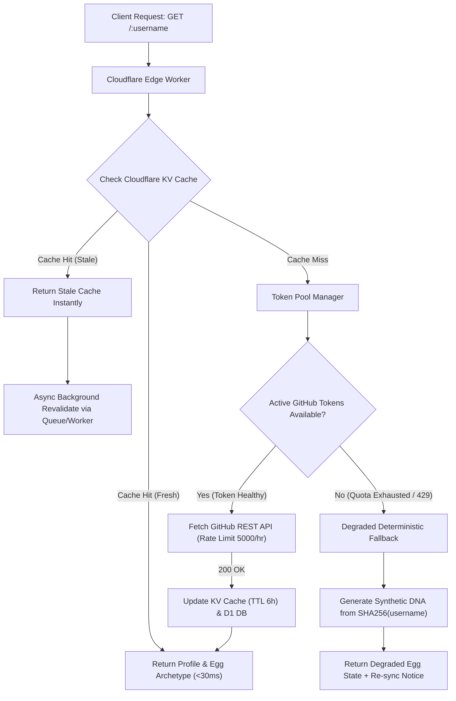

# Phase 1: Foundation, Infrastructure & GitHub Rate-Limit Resilient Resolver

## Overview

Thiết lập toàn bộ khung hạ tầng Edge-first trên **Cloudflare** (Pages/Workers, D1 SQLite, R2 Object Storage, KV Cache) và cấu hình domain `githoot.com`. Xây dựng hệ thống **GitHub Profile Resolver** chuyên dụng có khả năng kháng nghẽn (Anti-Throttling Architecture) bằng cách kết hợp: Pool xoay vòng GitHub App/PAT tokens, cơ chế Stale-While-Revalidate (SWR) trên Cloudflare KV, và chế độ Degraded Seed Fallback khi GitHub API bị cạn quota.

## Requirements

### Functional
- Cấu hình Domain `githoot.com` trên Cloudflare DNS với SSL/TLS Full Strict, HTTP/3 và WAF rules chống bot.
- Tạo D1 Database với schema hoàn chỉnh cho `users`, `github_accounts`, `guardians`, `early_access_slots`, và `token_pool`.
- Khởi tạo R2 Bucket `githoot-assets` kết nối Custom Domain `cdn.githoot.com` phục vụ ảnh và spritesheet không tốn phí egress.
- Triển khai Worker Route `GET /api/profile/:username` trả về dữ liệu profile chuẩn hóa, loại Trứng tương ứng và hạt giống DNA.
- Triển khai cơ chế xoay vòng (rotation) nhiều GitHub Tokens (GitHub App / PATs) kèm kiểm tra quota thời gian thực.
- Triển khai **Stale-While-Revalidate (SWR)** trong Cloudflare KV: Trả về cache cũ ngay lập tức (<20ms) và fetch background ngầm khi dữ liệu quá hạn.
- Triển khai **Degraded Mode**: Khi toàn bộ token GitHub hết quota (429/403), tự động tính toán hạt giống DNA từ SHA-256 của `username` để render Trứng mà không gây sập trang.

### Non-functional
- P95 response time cho `GET /api/profile/:username` < 150ms tại Edge (Cache hit < 30ms).
- Khả năng chịu tải tối thiểu 100.000 requests/giờ mà không làm gián đoạn hiển thị Trứng.
- Zero server cost (nằm hoàn toàn trong định mức Free/Pro của Cloudflare).

## Architecture



## Database Schema (Cloudflare D1)

```sql
-- users table
CREATE TABLE IF NOT EXISTS users (
    id TEXT PRIMARY KEY, -- uuid
    github_user_id INTEGER UNIQUE NOT NULL,
    status TEXT DEFAULT 'active',
    created_at INTEGER NOT NULL,
    updated_at INTEGER NOT NULL
);

-- github_accounts table
CREATE TABLE IF NOT EXISTS github_accounts (
    id TEXT PRIMARY KEY,
    user_id TEXT REFERENCES users(id),
    github_user_id INTEGER UNIQUE NOT NULL,
    login TEXT NOT NULL,
    avatar_url TEXT,
    name TEXT,
    bio TEXT,
    public_repos INTEGER DEFAULT 0,
    followers INTEGER DEFAULT 0,
    total_stars INTEGER DEFAULT 0,
    top_languages TEXT, -- JSON array
    claimed_at INTEGER,
    last_synced_at INTEGER NOT NULL
);

-- guardians table
CREATE TABLE IF NOT EXISTS guardians (
    id TEXT PRIMARY KEY,
    user_id TEXT NOT NULL REFERENCES users(id),
    github_user_id INTEGER UNIQUE NOT NULL,
    name TEXT NOT NULL,
    egg_type TEXT NOT NULL, -- archetype id
    species TEXT NOT NULL,
    element TEXT NOT NULL,
    dna_seed TEXT NOT NULL,
    rarity_tier TEXT NOT NULL, -- Common, Rare, Epic, Legendary, Mythic
    hero_image_url TEXT NOT NULL,
    spritesheet_url TEXT,
    traits TEXT NOT NULL, -- JSON
    level INTEGER DEFAULT 1,
    experience INTEGER DEFAULT 0,
    energy_state TEXT DEFAULT 'Active', -- Energetic, Active, Resting, Sleeping
    created_at INTEGER NOT NULL
);

-- early_access_slots table (100 free slots ledger)
CREATE TABLE IF NOT EXISTS early_access_slots (
    slot_number INTEGER PRIMARY KEY, -- 1 to 100
    github_user_id INTEGER UNIQUE,
    claimed_at INTEGER,
    status TEXT DEFAULT 'available' -- available, reserved, claimed
);

-- token_pool table for GitHub API rotation
CREATE TABLE IF NOT EXISTS github_token_pool (
    id TEXT PRIMARY KEY,
    token_masked TEXT NOT NULL,
    remaining_quota INTEGER DEFAULT 5000,
    reset_time INTEGER NOT NULL,
    is_active INTEGER DEFAULT 1
);
```

## Related Code Files

- Create: `wrangler.toml` (Cloudflare Pages/Worker bindings: D1, R2, KV, Queues)
- Create: `src/server/index.ts` (Edge entrypoint with Hono)
- Create: `src/server/db/schema.sql` (D1 migrations)
- Create: `src/server/services/github/token-pool.ts` (Multi-token manager & quota watcher)
- Create: `src/server/services/github/resolver.ts` (SWR caching + Degraded fallback logic)
- Create: `src/server/services/dna/seed.ts` (Deterministic DNA generator from numeric ID / SHA256)
- Create: `src/server/types/profile.ts` (TypeScript interfaces)

## Implementation Steps

1. **Khởi tạo dự án & Cloudflare Bindings:**
   - Cấu hình `wrangler.toml` định nghĩa D1 database `githoot_db`, KV namespace `GITHOOT_CACHE`, R2 bucket `githoot-assets`.
   - Cài đặt Hono framework tối ưu cho Edge: `bun add hono @hono/zod-validator`.
2. **Xây dựng GitHub Token Pool Manager (`token-pool.ts`):**
   - Hỗ trợ nạp mảng `GITHUB_TOKENS` từ Environment Secrets (danh sách PATs hoặc GitHub App installation tokens).
   - Cơ chế round-robin và tự động bỏ qua token khi header `x-ratelimit-remaining` < 20 cho đến khi reset.
3. **Hiện thực hóa SWR Resolver & Degraded Fallback (`resolver.ts`):**
   ```typescript
   export async function resolveGitHubProfile(username: string, env: Env): Promise<ResolvedProfile> {
     const cacheKey = `gh:profile:${username.toLowerCase()}`;
     const cached = await env.GITHOOT_CACHE.get<CachedProfile>(cacheKey, 'json');
     
     const now = Date.now();
     if (cached && now - cached.timestamp < 3600 * 1000) {
       return { ...cached.data, source: 'cache_fresh' };
     }
     
     // Stale cache present -> return immediately, trigger async revalidation
     if (cached) {
       env.REVALIDATE_QUEUE.send({ username }); // Async Cloudflare Queue
       return { ...cached.data, source: 'cache_stale' };
     }
     
     // Cache miss -> fetch GitHub API via Token Pool
     try {
       const token = await getTokenFromPool(env);
       const ghData = await fetchGitHubUser(username, token);
       const profile = normalizeProfile(ghData);
       
       await env.GITHOOT_CACHE.put(cacheKey, JSON.stringify({ timestamp: now, data: profile }), {
         expirationTtl: 86400 * 3 // 3 days max
       });
       return { ...profile, source: 'github_live' };
     } catch (err: any) {
       if (err.status === 403 || err.status === 429) {
         // Degraded Fallback: Compute deterministic seed from username
         return generateDegradedProfile(username);
       }
       throw err;
     }
   }
   ```
4. **Viết Deterministic DNA Seeder (`seed.ts`):**
   - Ánh xạ `github_user_id` (hoặc SHA-256 hash của username trong chế độ degraded) sang các chỉ số: `egg_archetype_id` (1–10), `element` (Fire, Water, Electric, Nature, Void, Cyber,...), `rarity_roll` (Common 60%, Rare 25%, Epic 10%, Legendary 4%, Mythic 1%).
5. **Thiết lập Migration & Seed D1:**
   - Chạy `wrangler d1 execute githoot_db --file=src/server/db/schema.sql`.
   - Khởi tạo sẵn 100 bản ghi trong bảng `early_access_slots` từ slot 1 đến 100.

## Success Criteria

- [ ] Lệnh `wrangler dev` khởi động thành công với đầy đủ D1, R2, KV bindings.
- [ ] Endpoint `GET /api/profile/:username` trả về đúng thông tin user thật với < 150ms trên lần gọi đầu và < 30ms trên lần gọi thứ hai.
- [ ] Test trường hợp cạn token GitHub: Hệ thống tự động chuyển sang Degraded Mode, trả về Egg Archetype hợp lệ và không văng lỗi 500.
- [ ] Schema D1 được khởi tạo và 100 slots Early Access sẵn sàng trong database.

## Risk Assessment

| Rủi ro | Tín hiệu nhận biết | Phương án xử lý |
|---|---|---|
| **GitHub ban IP Cloudflare** | Tất cả requests không kèm token bị chặn 403 tức thì | Bắt buộc 100% requests ra ngoài phải gắn Bearer Token từ Token Pool; cấu hình proxy egress nếu cần. |
| **KV Cache Cold-start Delay** | Username mới toanh tốn > 800ms để fetch từ GitHub | Hiển thị Skeleton animation mượt mà tại frontend trong khi worker fetch lần đầu. |
