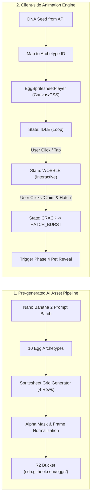

# Phase 2: Pre-Generated AI Egg Catalog & Spritesheet Animation Engine

## Overview

Tạo bộ sưu tập 8–10 loại Trứng huyền bí độc bản (Egg Archetypes) được thiết kế và sinh sẵn bằng AI (Pre-generated AI Assets) kèm theo hệ thống Spritesheets hoạt ảnh đa trạng thái (Idle, Wobble, Crack, Hatch). Xây dựng Engine phát hoạt ảnh Spritesheet Canvas/CSS siêu nhẹ tại Client (60fps, hỗ trợ tương tác click/hover, hiệu ứng âm thanh Web Audio sinh ra theo thuật toán) để biến trang `githoot.com/:username` thành một trải nghiệm sống động, kích thích trí tò mò của người xem mà **hoàn toàn không tiêu tốn chi phí gọi AI theo thời gian thực**.

## Requirements

### Functional
- Thiết kế 8–10 Egg Archetypes đặc trưng theo hệ ngôn ngữ & phong cách code:
  1. *Ember Core* (Hệ Lửa / Rust, C++, Go - Năng động, hiệu năng cao)
  2. *Neon Byte* (Hệ Cyber / TypeScript, React, Web - Sáng tạo, hiện đại)
  3. *Abyssal Pearl* (Hệ Thủy / Python, Data Science, AI - Sâu sắc, huyền bí)
  4. *Verdant Spore* (Hệ Mộc / Open Source Maintainer, Community - Bền bỉ)
  5. *Solar Flare* (Hệ Quang / Fullstack Shipper, Product Builder - Tốc độ)
  6. *Void Shard* (Hệ Hư Không / Security, DevOps, Kernel - Bí ẩn)
  7. *Rust Dynamo* (Hệ Cơ Khí / Systems Engineer, Low-level - Chắc chắn)
  8. *Celestial Echo* (Hệ Thần Thoại / Polyglot, 10x Engineer - Siêu hiếm)
- Mỗi Archetype gồm 1 Spritesheet tổng hợp định dạng WebP trong suốt (Alpha Channel) với 4 dải hoạt ảnh:
  - `idle`: 6 frames (Hiệu ứng thở nhẹ, hào quang nhấp nháy, lặp vòng tuần hoàn).
  - `wobble`: 8 frames (Trứng rung lắc dữ dội khi người dùng chạm/hover/click).
  - `crack`: 10 frames (Vỏ trứng xuất hiện các vết nứt phát sáng, mảnh vỡ hé lộ).
  - `hatch_burst`: 16 frames (Vỏ trứng phát nổ, tia sáng bùng cháy, khói ma thuật).
- Lưu trữ bộ Spritesheets + file định nghĩa khung hình `metadata.json` trên Cloudflare R2 (`cdn.githoot.com/eggs/{archetype_id}/`).
- Xây dựng Component `EggSpritesheetPlayer` trên nền HTML5 Canvas / CSS Steps (< 5KB, zero runtime dependency).
- Tích hợp Web Audio API Synthesizer: Sinh âm thanh tiếng gõ trứng (wobble tick), nứt vỏ (crack sound), và tiếng bùng nổ (hatch fanfare) trực tiếp từ code, không cần tải file MP3 ngoài.

### Non-functional
- Dung lượng mỗi Spritesheet WebP nén < 120KB.
- Tốc độ khung hình mượt mà 60fps trên cả thiết bị di động yếu.
- Hỗ trợ `prefers-reduced-motion`: Tự động chuyển sang ảnh tĩnh có hiệu ứng làm mờ tinh tế nếu người dùng tắt hoạt ảnh.

## Architecture



## Spritesheet Layout Contract

Mỗi file `spritesheet.webp` (Kích thước: 1024x1024 px hoặc 1536x1024 px) được chia thành lưới đồng nhất:
- **Hàng 1 (Frames 0–5):** `idle` (Kích thước mỗi ô: 256x256 px, 6 frames)
- **Hàng 2 (Frames 6–13):** `wobble` (Kích thước mỗi ô: 256x256 px, 8 frames)
- **Hàng 3 (Frames 14–23):** `crack` (Kích thước mỗi ô: 256x256 px, 10 frames)
- **Hàng 4 (Frames 24–39):** `hatch_burst` (Kích thước mỗi ô: 256x256 px, 16 frames)

File `metadata.json` mẫu:
```json
{
  "archetype_id": "neon-byte",
  "name": "Neon Byte Egg",
  "element": "Cyber",
  "frame_width": 256,
  "frame_height": 256,
  "animations": {
    "idle": { "start": 0, "count": 6, "fps": 8, "loop": true },
    "wobble": { "start": 6, "count": 8, "fps": 16, "loop": false },
    "crack": { "start": 14, "count": 10, "fps": 12, "loop": false },
    "hatch": { "start": 24, "count": 16, "fps": 20, "loop": false }
  }
}
```

## Related Code Files

- Create: `src/client/components/EggSpritesheetPlayer.tsx` (Canvas animation player component)
- Create: `src/client/hooks/useEggAudio.ts` (Web Audio procedural sound effects)
- Create: `src/client/assets/eggs/manifest.ts` (Egg archetypes definitions & metadata)
- Create: `scripts/generate-egg-spritesheets.ts` (Batch prompt compiler & asset processor for Nano Banana 2)
- Modify: `src/client/pages/PublicProfilePage.tsx` (Tích hợp Egg Player vào giao diện `/:username`)

## Implementation Steps

1. **Sinh Assets và Đóng gói Spritesheet (`generate-egg-spritesheets.ts`):**
   - Sử dụng script gọi Gemini Nano Banana 2 sinh 8–10 mẫu trứng với prompt phong cách pixel/fantasy chất lượng cao kèm lưới khung hình.
   - Xóa nền trắng/đen thành transparent alpha và nén thành WebP tối ưu.
   - Upload toàn bộ assets lên R2 Bucket `githoot-assets/eggs/`.
2. **Xây dựng Canvas Spritesheet Player (`EggSpritesheetPlayer.tsx`):**
   ```typescript
   export const EggSpritesheetPlayer: React.FC<{
     archetypeId: string;
     state: 'idle' | 'wobble' | 'crack' | 'hatch';
     onHatchComplete?: () => void;
   }> = ({ archetypeId, state, onHatchComplete }) => {
     // Canvas requestAnimationFrame loop
     // Render frame slices from cached Image bitmap
     // Trigger onHatchComplete when hatch sequence reaches final frame
   };
   ```
3. **Hiện thực Web Audio Procedural Synthesizer (`useEggAudio.ts`):**
   - Tạo các âm thanh phong cách 8-bit / Arcade: Tiếng nứt vỏ (Noise buffer + Bandpass filter), Tiếng lắc trứng (Pitch bend sine oscillator), Tiếng nở hoa (Major triad arpeggio).
4. **Tích hợp giao diện Công khai `/:username`:**
   - Hiển thị Trứng lơ lửng với hoạt ảnh Idle.
   - Khi người dùng click vào Trứng, phát âm thanh và chuyển sang hoạt ảnh `wobble`.
   - Hiển thị badge: *"Tài khoản sở hữu: @username"*, *"Độ hiếm ước tính: ???*" cùng nút CTA nổi bật: **"Claim & Hatch This Guardian"**.

## Success Criteria

- [ ] 8–10 loại Trứng AI được tải lên R2 và truy cập mượt mà qua CDN `cdn.githoot.com/eggs/...`.
- [ ] Component `EggSpritesheetPlayer` chạy đạt 60fps trên Chrome, Safari, Firefox và Mobile Web.
- [ ] Tương tác click vào trứng phản hồi tức thì với hoạt ảnh wobble và âm thanh sinh động.
- [ ] Toàn bộ trang tải không cần gọi bất kỳ external AI API nào, dung lượng tải ban đầu < 250KB.

## Risk Assessment

| Rủi ro | Tín hiệu nhận biết | Phương án xử lý |
|---|---|---|
| **Lỗi tải ảnh Spritesheet do mạng yếu** | Canvas trống rỗng, người dùng không thấy trứng | Preload ảnh ngay từ thẻ `<link rel="preload">`; hiển thị ảnh poster tĩnh (fallback WebP frame 0) trước khi nạp xong toàn bộ spritesheet. |
| **Trình duyệt chặn Web Audio tự phát** | Không có âm thanh khi mới vào trang | Chỉ kích hoạt `AudioContext.resume()` khi người dùng thực hiện tương tác đầu tiên (Click/Tap vào trứng). |
