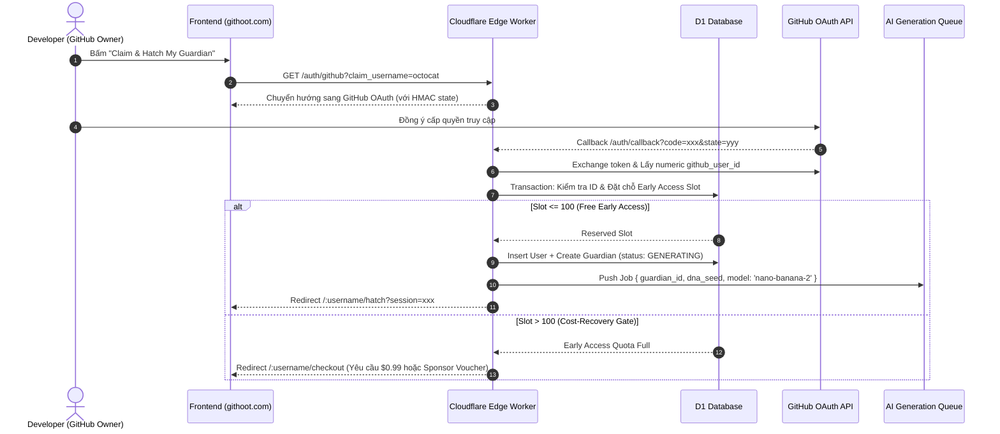

# Phase 3: GitHub OAuth, Early Access Gate & Claim Transaction

## Overview

Hiện thực hóa toàn bộ luồng đăng nhập và cấp quyền bảo mật thông qua **GitHub OAuth 2.0**. Triển khai bộ điều khiển **Early Access Quota Controller** (Sổ cái 100 suất mở trứng miễn phí đầu tiên ghi nhận nguyên tử trong Cloudflare D1) cùng cơ chế tính toán chi phí / cổng thanh toán hoàn vốn (Cost-Recovery Gate) từ lượt mở thứ 101 trở đi để đảm bảo dự án không bao giờ bị âm ngân sách AI. Đóng gói giao dịch **Claim Transaction** bảo đảm tính lũy kế (idempotent), chống gian lận và xác nhận chính chủ 100%.

## Requirements

### Functional
- Cấu hình GitHub OAuth App với các quyền tối thiểu (`read:user`, `public_repo`).
- Xây dựng luồng xác thực:
  - `GET /auth/github`: Sinh chuỗi `state` ngẫu nhiên có chữ ký HMAC, lưu cookie HTTP-Only và chuyển hướng sang GitHub.
  - `GET /auth/callback`: Xác thực `state`, đổi `code` lấy Access Token, truy vấn numeric `github_user_id`.
- Triển khai **Early Access Quota Controller (100 Slots Ledger)**:
  - Quản lý 100 slot mở trứng miễn phí nguyên tử (Atomic reservation) trong D1 Database.
  - Hiển thị công khai số lượng slot còn lại theo thời gian thực (ví dụ: *"Chỉ còn 37/100 suất Early Access miễn phí"*).
  - Slot 1 đến 100: Kích hoạt Claim & Sinh ảnh miễn phí ngay lập tức.
  - Slot 101 trở đi: Chuyển sang chế độ **Cost-Recovery Mode** — hiển thị thông báo chi phí rõ ràng (ví dụ: $0.99 / 1 Credit hoặc Sponsored Code) trước khi trigger sinh ảnh AI.
- Triển khai **Atomic Claim Transaction**:
  - Kiểm tra `github_user_id` đã sở hữu Guardian chưa (Nếu có -> chuyển thẳng đến trang Profile đã claim).
  - Khóa slot Early Access (hoặc xác nhận payment token).
  - Khởi tạo bản ghi `users`, cập nhật `github_accounts.claimed_at = now()`.
  - Tạo bản ghi `guardians` với trạng thái `PENDING_GENERATION`.
  - Đẩy Job sinh ảnh vào Cloudflare Queue `ai-generation-queue`.

### Non-functional
- Chống tấn công CSRF / State Replay 100%.
- Không bao giờ sinh lần 2 (không reroll DNA) khi người dùng refresh hoặc submit nhiều lần cùng lúc.
- Thời gian xử lý OAuth Callback đến khi trả về giao diện chờ < 400ms.

## Architecture



## Database Transactions & State Machine

Trạng thái của Guardian trong quá trình Claim:
```text
UNCLAIMED (Chỉ có Trứng SVG/Canvas)
      ↓ (User OAuth & Reserve Slot)
PENDING_GENERATION (Đã khóa slot, đẩy vào Queue)
      ↓ (Worker gọi Gemini Nano Banana 2)
ASSET_READY (Ảnh Hero & Spritesheet đã lưu vào R2)
      ↓ (Client phát xong hoạt ảnh vỡ trứng)
HATCHED_ACTIVE (Hoàn tất nghi thức mở trứng, profile chính thức)
```

Truy vấn đặt chỗ slot nguyên tử (D1 SQLite):
```sql
-- Atomic Slot Reservation
UPDATE early_access_slots 
SET github_user_id = ?1, claimed_at = ?2, status = 'claimed'
WHERE slot_number = (
    SELECT slot_number FROM early_access_slots 
    WHERE status = 'available' 
    ORDER BY slot_number ASC 
    LIMIT 1
);
```

## Related Code Files

- Create: `src/server/routes/auth.ts` (OAuth login start & callback handlers)
- Create: `src/server/services/auth/oauth.ts` (GitHub OAuth API client with HMAC state verification)
- Create: `src/server/services/claim/quota.ts` (Early Access 100-slot atomic ledger & cost manager)
- Create: `src/server/services/claim/transaction.ts` (D1 transactional claim orchestrator)
- Create: `src/client/pages/HatchWaitPage.tsx` (SSE / Polling listener for generation readiness)
- Create: `src/client/pages/CheckoutModal.tsx` (Giao diện Cost-Recovery cho slot 101+)

## Implementation Steps

1. **Xây dựng OAuth HMAC Security (`oauth.ts`):**
   - Ký payload `{ timestamp, claimTarget, nonce }` bằng `AUTH_SECRET` để tạo state.
   - Khi nhận callback, kiểm tra chữ ký và đảm bảo `timestamp` không quá 10 phút để triệt tiêu replay attack.
2. **Hiện thực Quota Ledger (`quota.ts`):**
   - Đếm số slot khả dụng trực tiếp từ bảng `early_access_slots`.
   - Cung cấp API `GET /api/early-access/status` trả về: `{ total: 100, claimed: 63, remaining: 37, is_free: true }`.
3. **Thực thi Giao dịch Claim (`transaction.ts`):**
   - Xác thực `authenticated_id === target_profile_id`. (Chống tình huống user A đăng nhập rồi claim trộm profile user B).
   - Chạy batch transaction trên D1: Tạo user, gán slot, ghi nhận DNA và khởi tạo guardian.
4. **Xây dựng SSE / Polling Hub cho Frontend (`HatchWaitPage.tsx`):**
   - Frontend kết nối endpoint `GET /api/guardians/:id/status` qua Server-Sent Events (hoặc polling mỗi 1s).
   - Khi trạng thái chuyển thành `ASSET_READY`, kích hoạt hoạt ảnh vỡ trứng `hatch_burst` được chuẩn bị từ Phase 2.

## Success Criteria

- [ ] Luồng đăng nhập GitHub OAuth hoạt động an toàn, chống 100% các cuộc tấn công CSRF / State tampering.
- [ ] User A không thể claim hộ hoặc claim đè lên profile của User B.
- [ ] 100 slot Early Access đầu tiên được phân bổ chính xác từng số thứ tự (Slot 1 đến 100) không bị trùng lặp khi có concurrent requests.
- [ ] Lượt truy cập thứ 101 hiển thị chính xác giao diện Cost-Recovery Gate, ngăn chặn việc gọi API AI gây thâm hụt tài chính.

## Risk Assessment

| Rủi ro | Tín hiệu nhận biết | Phương án xử lý |
|---|---|---|
| **2 người dùng claim đồng thời tranh chấp slot cuối** | Xung đột ghi đồng thời vào slot #100 | Sử dụng SQLite single-write transaction của D1; nếu tranh chấp, rollback và chuyển request thứ hai sang Cost-Recovery Gate minh bạch. |
| **OAuth Callback bị lỗi mạng giữa chừng** | User đã cấp quyền GitHub nhưng Worker chưa ghi DB | Endpoint callback hỗ trợ retry an toàn: Nếu user đã tồn tại, load lại trạng thái cũ và redirect về đúng màn hình chờ. |
