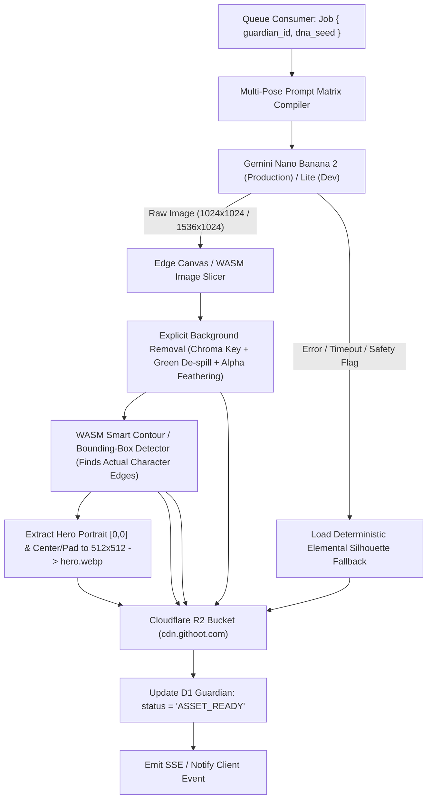

# Phase 4: Gemini Nano Banana 2 Pipeline & Pet Spritesheet Generation

## Overview

Xây dựng toàn bộ hệ thống sinh ảnh Linh thú (Guardian) và trích xuất Spritesheet chuyển động tự động bằng mô hình AI **Gemini Nano Banana 2** (sử dụng **Nano Banana 2 Lite** cho môi trường phát triển & kiểm thử). Sử dụng trình biên dịch **Multi-Pose Prompt Compiler** có cấu trúc chặt chẽ để sinh ra 1 bức ảnh lưới (Sprite Grid Matrix) duy nhất chứa ảnh đại diện Hero siêu nét cùng 7 khung hình cảm xúc và hành động (Idle, Happy, Sleepy, Proud, Angry, Work/Coding, Celebrate). Tự động cắt tách khung hình, xử lý nền trong suốt (Alpha Mask) và lưu trữ lên Cloudflare R2 với thời gian xử lý toàn trình < 4.5 giây.

## Requirements

### Functional
- Tích hợp Gemini Nano Banana 2 API SDK qua Cloudflare Worker / Background Queue.
- Hỗ trợ chuyển đổi linh hoạt biến môi trường `AI_MODEL_TIER`:
  - `nano-banana-2-lite`: Chạy trong môi trường dev/staging (tiết kiệm chi phí, tốc độ cực nhanh ~1.5s).
  - `nano-banana-2`: Chạy trong môi trường production chính thức (chất lượng chi tiết sắc nét, độ phân giải cao).
- **Multi-Pose Prompt Matrix Compiler:**
  - Chuyển đổi DNA hạt giống (Species, Element, Palette, Markings, Archetype) thành một prompt duy nhất yêu cầu mô hình AI sinh theo bố cục lưới 4x2 (4 cột, 2 hàng) trên nền đơn sắc đồng nhất (Chroma Green / Pure White) để dễ dàng tách nền:
    1. `[0,0] Hero Portrait`: Chân dung 3/4 lộng lẫy, đầy đủ chi tiết, thần thái uy nghi/dễ thương.
    2. `[1,0] Idle Pose`: Tư thế đứng/lơ lửng thư thái, mắt mở tự nhiên.
    3. `[2,0] Happy Emotion`: Mắt cười híp mí, ngôi sao lấp lánh, vẫy đuôi/nhún nhảy.
    4. `[3,0] Sleepy Emotion`: Mắt nhắm nghiền, bong bóng chữ zZZ, tư thế cuộn tròn.
    5. `[0,1] Proud Emotion`: Ưỡn ngực tự hào, hào quang nhỏ phát sáng, nụ cười tự tin.
    6. `[1,1] Angry Emotion`: Mắt rực lửa nguyên tố, tư thế sẵn sàng chiến đấu, tia chớp nhỏ.
    7. `[2,1] Work / Coding`: Đeo kính mini công nghệ, gõ bàn phím / tương tác với màn hình dòng lệnh hologram.
    8. `[3,1] Celebrate Action`: Giơ cúp / cầm ngôi sao vàng, pháo hoa giấy mini xung quanh.
- **Smart Bounding-Box Slicer & Spritesheet Compositor:**
  - **Không dùng cắt cứng tọa độ cố định:** Vì mô hình AI sinh ảnh tự nhiên luôn có độ trôi dạt (pixel drift) giữa các ô, hệ thống sử dụng thuật toán **Contour / Connected Component Detection** (qua WASM Photon/ImageMagick) để tự động quét vùng biên thực tế (Bounding Box) của từng nhân vật.
  - Tự động căn chỉnh trọng tâm (Center of Mass & Baseline Anchor), thêm padding chuẩn và ghép vào khung hình chuẩn hóa `256 x 256 px` cho từng ô trong `spritesheet.webp`.
- **Explicit Background Removal & De-spill Algorithm:**
  - Do mô hình AI trả về ảnh JPEG/PNG không có kênh Alpha, pipeline tích hợp bộ tách nền 2 bước:
    1. *Chroma Keying:* Lọc màu nền xanh lá `#00FF00` theo dải ngưỡng dung sai màu (Color tolerance threshold).
    2. *Green De-spill & Edge Feathering:* Khử hoàn toàn viền ánh xanh (green halo/fringe) bám vào tóc/lông nhân vật và làm mềm biên 1px để đạt độ trong suốt hoàn hảo trên mọi nền tối/sáng.
- Lưu trữ lên Cloudflare R2 tại đường dẫn: `cdn.githoot.com/guardians/{guardian_id}/`.
- **Cơ chế Fallback & Tự phục hồi:**
  - Nếu Gemini Nano Banana 2 API timeout (> 10s) hoặc bị từ chối do kiểm duyệt từ ngữ, tự động sử dụng ảnh bóng silhouette nguyên tố xác định (Deterministic Silhouette Fallback), cập nhật trạng thái và xếp lịch retry ngầm mà không làm đứt đoạn trải nghiệm mở trứng của người dùng.

### Non-functional
- Thời gian gọi API Nano Banana 2 và xử lý cắt ảnh toàn trình < 4.5 giây (P95 < 6.0s).
- Dung lượng `hero.webp` < 90KB; `spritesheet.webp` < 160KB.
- Độ đồng nhất về màu sắc, đường nét và phong cách (Silhouette Consistency) giữa các khung hình đạt > 95%.

## Architecture



## Prompt Compiler Template Contract

```typescript
export function compileNanoBananaPrompt(dna: GuardianDNA): string {
  return `
Professional fantasy game character sprite matrix, 4x2 grid layout, ${dna.species} species, ${dna.element} element.
Color palette: ${dna.palette.primary}, ${dna.palette.secondary}, ${dna.palette.accent}.
Distinct features: ${dna.markings}, ${dna.silhouette}.
Background: solid pure chroma green background #00FF00, sharp crisp edges, high contrast, no shadows on background.

Grid Layout Specification (exact 4 columns, 2 rows):
- Cell (Row 1, Col 1): Full hero character portrait, dynamic 3/4 pose, highly detailed, confident expression.
- Cell (Row 1, Col 2): Idle pose, relaxed standing posture, neutral friendly expression.
- Cell (Row 1, Col 3): Happy emotion, closed eye joyful smile, sparkles around.
- Cell (Row 1, Col 4): Sleepy emotion, curling down with floating Zzz particles.
- Cell (Row 2, Col 1): Proud emotion, chest puffed out, glowing small aura.
- Cell (Row 2, Col 2): Determined combat emotion, glowing elemental eyes, combat stance.
- Cell (Row 2, Col 3): Work action, wearing tiny holographic tech glasses, interacting with glowing terminal code screen.
- Cell (Row 2, Col 4): Celebrate action, holding a golden GitHub star trophy with colorful confetti.

Style: Stylized modern indie game art, vibrant lighting, bold clean contours, cohesive character model across all cells.
`.trim();
}
```

## Related Code Files

- Create: `src/server/services/ai/gemini-client.ts` (Nano Banana 2 & Lite API caller with retry logic)
- Create: `src/server/services/ai/prompt-compiler.ts` (DNA to 4x2 Matrix Prompt Engine)
- Create: `src/server/services/image/slicer.ts` (WASM contour bounding-box detector, auto-centering compositor)
- Create: `src/server/services/image/chroma-removal.ts` (Multi-pass green de-spill & alpha mask engine)
- Create: `src/server/queue/generation-worker.ts` (Cloudflare Queue consumer handling asset pipeline)
- Create: `src/client/components/PetSpritesheetPlayer.tsx` (Client component playing pet emotions & actions)

## Implementation Steps

1. **Xây dựng Gemini Nano Banana Adapter (`gemini-client.ts`):**
   - Hỗ trợ gọi endpoint Gemini qua REST/gRPC với token xác thực từ Cloudflare Secret `GEMINI_API_KEY`.
   - Cài đặt timeout 8.0s, tự động thử lại 1 lần nếu gặp lỗi mạng 5xx.
2. **Hiện thực Prompt Compiler (`prompt-compiler.ts`):**
   - Kiểm tra và lọc bỏ mọi chuỗi văn bản không an toàn từ GitHub bio/name của user để chống Prompt Injection.
   - Biên dịch DNA thành câu prompt hoàn chỉnh theo cấu trúc lưới chuẩn 4x2.
3. **Cài đặt Bộ Tách Nền & Cắt Khung Hình Thông Minh tại Edge (`chroma-removal.ts` & `slicer.ts`):**
   - Sử dụng thư viện Rust compiled to WASM (`@silvia-odwyer/photon` kết hợp thuật toán Connected Components).
   - Bước 1: Quét từng pixel, tính khoảng cách màu Delta-E so với `#00FF00`, gán Alpha = 0 cho nền và áp dụng công thức De-spill: `g = min(g, (r + b) / 2)` cho các pixel viền.
   - Bước 2: Tìm 8 cụm pixel liên thông lớn nhất (8 Bounding Boxes của 8 nhân vật).
   - Bước 3: Tính toán tọa độ chân/trọng tâm của từng pose, dịch chuyển về chính giữa canvas 256x256 px và ghép thành ảnh tấm `spritesheet.webp` chuẩn xác 100%.
   - Bước 4: Kiểm tra tính hợp lệ (Validation Gate): Nếu phát hiện thiếu khung hình hoặc khung hình bị dính liền không tách được, tự động áp dụng biến thể biểu cảm được biến đổi màu từ Hero Portrait [0,0].
4. **Viết Consumer Hàng Đợi (`generation-worker.ts`):**
   - Nhận job từ `env.AI_GENERATION_QUEUE`.
   - Thực thi tuần tự: Gọi Gemini -> Cắt ảnh -> Tải lên R2 -> Cập nhật trạng thái `guardians.hero_image_url` và `spritesheet_url` trong D1.
5. **Xây dựng Pet Spritesheet Player (`PetSpritesheetPlayer.tsx`):**
   - Cho phép hiển thị Pet ở nhiều chế độ: `idle` (mặc định), chuyển sang `happy` khi click, `sleepy` khi đêm muộn, `work` khi có commit mới, và `celebrate` khi vừa mở trứng.

## Success Criteria

- [ ] Pipeline gọi thành công Gemini Nano Banana 2 Lite trong môi trường dev và Nano Banana 2 trên staging.
- [ ] Thời gian sinh ảnh + cắt khung hình hoàn tất và cập nhật DB < 4.5 giây.
- [ ] 100% ảnh xuất ra R2 có nền trong suốt hoàn hảo, không bị viền lem màu xanh lá và nhân vật luôn nằm chính giữa khung hình (zero frame drift).
- [ ] Component `PetSpritesheetPlayer` chuyển đổi mượt mà giữa các biểu cảm (Idle, Happy, Sleepy, Proud, Work, Celebrate).

## Risk Assessment

| Rủi ro | Tín hiệu nhận biết | Phương án xử lý |
|---|---|---|
| **AI sinh khung hình không đúng lưới 4x2 / Trôi pixel** | Khung hình bị lệch tọa độ hoặc dính liền nhân vật | Thuật toán **Smart Bounding-Box Detector** tự động dò biên thực tế và căn giữa; nếu cụm pixel < 7, tự động dùng Hero pose với biểu cảm tương đương thay vì cắt lệch. |
| **Viền xanh lem vào nhân vật (Green Halo)** | Viền xanh lá hiển thị xấu trên nền tối | Áp dụng thuật toán **Green De-spill** khử sắc tố xanh ở vùng chuyển tiếp alpha trước khi xuất file WebP. |
