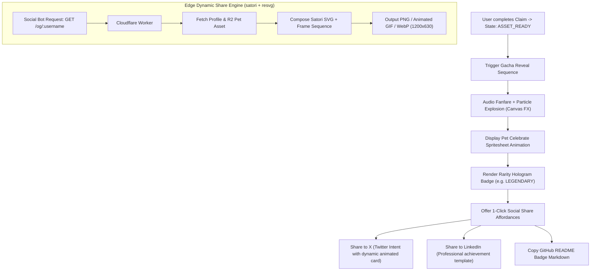

# Phase 5: Gacha Reveal Experience, Viral Distribution & Animated Share Previews

## Overview

Thiết kế nghi thức mở trứng mang phong cách **Gacha Nhật Bản** (Gacha Hatching Ritual) đầy kịch tính, lôi cuốn và bất ngờ để kích hoạt cảm xúc hào hứng tột độ cho lập trình viên khi đón chào Linh thú của mình. Xây dựng động cơ sinh thẻ chia sẻ động **Animated OpenGraph / Social Share Engine** (hỗ trợ GIF, APNG, WebP động và MP4 preview) cùng các nút **1-Click Share lên X (Twitter)** và **LinkedIn** với mẫu bài đăng được tối ưu hóa cho thuật toán mạng xã hội. Đồng thời cung cấp endpoint nhúng **Dynamic SVG README Badge** (`githoot.com/badge/:username.svg`) để hiển thị trực tiếp trên trang cá nhân GitHub.

## Requirements

### Functional
- **Nghi thức Mở trứng Gacha (Hatch Reveal Ritual):**
  - Trình tự kịch tính:
    1. *Tích tụ năng lượng:* Trứng rung lắc với tần số tăng dần, phát ra âm thanh hồi hộp.
    2. *Vết nứt ánh sáng:* Vỏ trứng xuất hiện các vệt nứt màu sắc tương ứng với hệ nguyên tố (Lửa, Nước, Sấm sét, Cyber...).
    3. *Bùng nổ (Hatch Burst):* Vỏ trứng vỡ vụn kèm hiệu ứng pháo hoa hạt (Particle confetti explosion) và âm thanh Fanfare đắc thắng.
    4. *Xuất hiện (The Reveal):* Linh thú hiện ra với hoạt ảnh `celebrate` (nhún nhảy, cầm cúp sao vàng), hào quang lấp lánh và thẻ phân hạng độ hiếm (Rarity Badge Hologram).
- **Hệ thống Độ hiếm & Danh hiệu (Rarity & Titles):**
  - Phân bổ độ hiếm ngẫu nhiên có kiểm soát: *Common* (60%), *Rare* (25%), *Epic* (10%), *Legendary* (4%), *Mythic* (1%).
  - Danh hiệu tự động sinh từ thống kê repo: Ví dụ: *"Cyber Code-Weaver"*, *"Ember Rust-Shipper"*, *"Void Guardian"*.
- **Động cơ Sinh ảnh & Hoạt ảnh Chia sẻ Mạng Xã Hội (`/og/:username`):**
  - `GET /og/:username.png`: Sinh ảnh OpenGraph độ phân giải cao (1200x630 px) kết hợp ảnh đại diện GitHub + Hero Pet + Tên + Độ hiếm + Top ngôn ngữ qua thư viện `@resvg/resvg-wasm` + `satori`.
  - `GET /og/:username.gif` / `.webp`: Sinh hoạt ảnh động lặp vòng 3–5 giây hiển thị Pet đang cử động biểu cảm để nhúng vào bài đăng X/Twitter, Discord, Telegram.
- **Tích hợp 1-Click Social Sharing:**
  - Nút **"Share to X (Twitter)"**: Tự động mở cửa sổ Intent với nội dung mẫu kích thích tò mò:
    > *"Vừa mở khóa được một chú Ember Fox bậc [Legendary] trên @GitHoot! 🔥 Linh thú này đang bảo hộ cho các dự án mã nguồn mở của tôi. Nhận nuôi miễn phí Linh thú của bạn (chỉ còn lại ít suất): https://githoot.com/octocat"*
  - Nút **"Share to LinkedIn"**: Bài đăng chuyên nghiệp nhấn mạnh phong cách code và danh hiệu của lập trình viên.
  - Nút **"Copy Markdown Badge"**: Cung cấp đoạn mã nhúng README một chạm.
- **Dynamic GitHub README Badge (`/badge/:username.svg`):**
  - Endpoint siêu nhẹ (< 5KB SVG, cache Edge 12h) hiển thị: Icon Pet đang thở, Level 1, Hệ nguyên tố, và link dẫn thẳng về `githoot.com/:username`.

### Non-functional
- Thời gian sinh Dynamic OG Image / GIF tại Edge Worker < 350ms (Cache hit < 20ms).
- Giao diện nghi thức mở trứng tương thích hoàn hảo trên màn hình cảm ứng di động và desktop, hỗ trợ haptic feedback (rung điện thoại) trên các thiết bị di động hỗ trợ.

## Architecture

## Social Card Template Layout

Bố cục chuẩn của thẻ chia sẻ OpenGraph (`1200 x 630 px`):
- **Bên trái (Chiếm 45%):** Ảnh Pet độ phân giải cao nổi bật trên nền hào quang nguyên tố, kèm Badge độ hiếm Hologram lấp lánh.
- **Bên phải (Chiếm 55%):**
  - Logo `GitHoot.com` rực rỡ ở góc trên.
  - Tên lập trình viên `@username` & Avatar GitHub tròn.
  - Danh hiệu huyền bí (Ví dụ: *"The Legendary Cyber Alchemist"*).
  - Thống kê đóng góp: *Top Language: TypeScript | Stars: 1,420 | Status: Active Guardian*.
  - Thanh kêu gọi hành động: *"Hatch your GitHub companion at githoot.com"*.

## Related Code Files

- Create: `src/client/components/GachaRevealModal.tsx` (Gacha animation, sound, particles & reveal sequence)
- Create: `src/client/components/SocialSharePanel.tsx` (1-click share buttons to X, LinkedIn, Discord & Copy badge)
- Create: `src/server/routes/og.ts` (Dynamic OpenGraph PNG / GIF / WebP renderer at Edge)
- Create: `src/server/routes/badge.ts` (Dynamic SVG README Badge generator)
- Create: `src/client/utils/particles.ts` (Lightweight Canvas particle confetti engine)

## Implementation Steps

1. **Xây dựng Nghi thức Gacha (`GachaRevealModal.tsx` & `particles.ts`):**
   - Lập trình hiệu ứng rung lắc gia tốc của Trứng bằng CSS keyframes.
   - Khi chuyển sang pha nổ, kích hoạt hệ thống hạt Canvas bắn ra 150 hạt confetti đa sắc màu phản chiếu theo màu hệ nguyên tố của Pet.
   - Phát âm thanh Fanfare qua Web Audio API.
2. **Hiện thực Edge OpenGraph Renderer (`og.ts`):**
   - Sử dụng `satori` biến đổi JSX component thành SVG.
   - Sử dụng `@resvg/resvg-wasm` render SVG thành file ảnh PNG hoặc xuất chuỗi khung hình thành GIF/APNG tối ưu.
   - Cache kết quả trên Cloudflare KV với key `og:{username}:{version}`.
3. **Hiện thực Dynamic README Badge (`badge.ts`):**
   - Viết template SVG phẳng (Flat / Shield style) hiển thị icon của Pet, Level, và tên hệ nguyên tố.
   - Gắn header `Cache-Control: public, max-age=43200, s-maxage=43200` để GitHub Camo proxy cache hiệu quả.
4. **Tích hợp Nút Chia sẻ 1-Click (`SocialSharePanel.tsx`):**
   - Cung cấp link X Web Intent: `https://twitter.com/intent/tweet?text=...&url=...`
   - Cung cấp link LinkedIn Share: `https://www.linkedin.com/sharing/share-offsite/?url=...`
   - Hiển thị nút copy kèm thông báo toast: *"Đã sao chép mã nhúng README! Dán vào GitHub của bạn ngay!"*

## Success Criteria

- [ ] Trải nghiệm nghi thức mở trứng chạy mượt mà 60fps, mang lại cảm xúc phấn khích và bất ngờ.
- [ ] Khi share link `githoot.com/:username` lên Twitter/X hoặc Discord, thẻ Open Graph hiển thị hình ảnh Pet + chỉ số sắc nét và đẹp mắt.
- [ ] Nút 1-Click Share tự động điền sẵn nội dung bài đăng cuốn hút và URL dẫn về đúng profile.
- [ ] Badge nhúng `/badge/:username.svg` hiển thị chuẩn xác trên GitHub README của lập trình viên.

## Risk Assessment

| Rủi ro | Tín hiệu nhận biết | Phương án xử lý |
|---|---|---|
| **Twitter Crawler không nạp kịp OG Image** | Bài post trên X bị trắng ảnh hoặc chỉ hiện link chữ | Worker sinh ảnh OG trước và cache sẵn vào KV ngay khi Pet vừa được sinh xong (Pre-warm OG Cache); không đợi bot đến mới sinh. |
| **User tắt trình duyệt khi đang mở trứng** | Trạng thái mở trứng bị kẹt dở dang | Lưu cờ `has_watched_reveal = true` trong LocalStorage/D1; nếu user vào lại, hiển thị nút *"Xem lại khoảnh khắc nở"* bất cứ lúc nào. |
