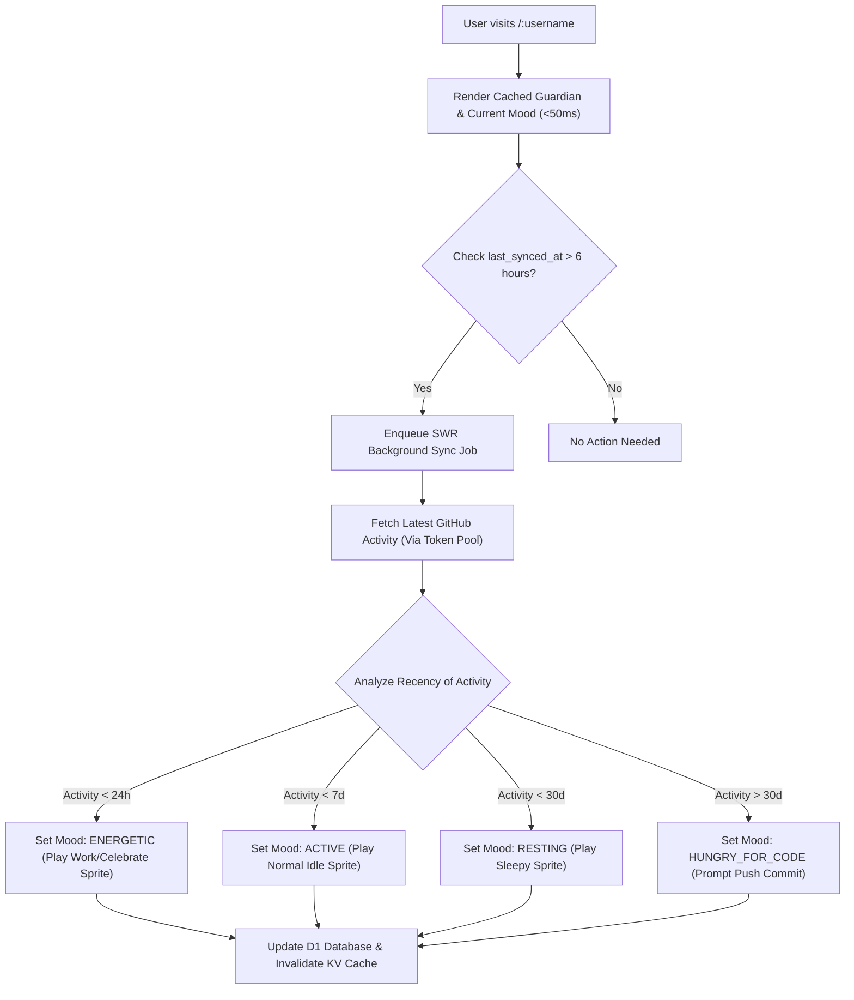

# Phase 6: Retention Loop, Tamagotchi State & Launch Polish

## Overview

Thiết lập cơ chế giữ chân người dùng (Retention Loop) theo phong cách **Tamagotchi nuôi thú ảo tích cực** (Positive-only reinforcement) dựa trên hoạt động GitHub thực tế. Xây dựng hệ thống theo dõi trạng thái năng lượng (Energetic, Active, Resting, Hungry for code), cơ chế cập nhật chỉ số ngầm khi ghé thăm (SWR Refresh), hệ thống kiểm soát ngân sách AI tự động (Budget Hard-Cap Alert) và bộ công cụ kiểm thử toàn trình trước khi ra mắt chính thức trên Product Hunt và mạng xã hội X.

## Requirements

### Functional
- **Cơ chế Tâm trạng & Năng lượng Tamagotchi (Energy & Mood States):**
  - *Energetic (Tràn đầy năng lượng):* Có commit hoặc merged PR trong vòng 24 giờ qua. Linh thú hiển thị hoạt ảnh `work` hoặc `celebrate`, tỏa hào quang rực rỡ.
  - *Active (Khỏe mạnh/Bình thường):* Có hoạt động trong 7 ngày qua. Linh thú hiển thị hoạt ảnh `idle` vui vẻ, nhún nhảy khi được click.
  - *Resting (Nghỉ ngơi):* Không có hoạt động từ 7–30 ngày. Linh thú chuyển sang hoạt ảnh `sleepy` cuộn tròn với bong bóng zZZ lơ lửng.
  - *Hungry for Code (Đói code):* Không có hoạt động > 30 ngày. Linh thú mở to mắt tò mò nhìn chủ nhân kèm thông điệp đáng yêu: *"Hãy push 1 commit lên GitHub để đánh thức bé nhé!"*
  - **Nguyên tắc bất di bất dịch:** Không bao giờ phạt người dùng, không làm chết Pet, không giảm Level, không xóa dữ liệu.
- **Tự động Cập nhật Chỉ số ngầm (SWR Activity Sync):**
  - Mỗi khi chủ nhân hoặc khách ghé thăm `githoot.com/:username`, hệ thống đối chiếu timestamp `last_synced_at`. Nếu > 6 giờ, đẩy 1 job ngầm vào hàng đợi để cập nhật lại số lượng commit, stars, repos và làm mới tâm trạng của Pet.
- **Hệ thống Kiểm soát Ngân sách AI (Daily Spending Hard-Cap):**
  - Theo dõi tổng số tiền gọi API Gemini Nano Banana 2 theo ngày.
  - Cài đặt trần cứng ngân sách (ví dụ: $20/ngày trong tuần đầu ra mắt).
  - Khi chạm trần ngân sách: Tự động chuyển các lượt hatch mới vào hàng đợi chờ (Waitlist / Roll sang ngày hôm sau) hoặc yêu cầu dùng Credit cá nhân, tuyệt đối không để tài khoản bị âm tiền ngoài dự kiến.
- **Chiến dịch Pre-warming & Danh sách Khởi chạy (Launch Kit):**
  - Chạy script pre-warm cache và sinh sẵn Trứng cho danh sách Top 500 nhà sáng tạo nội dung / KOC / lập trình viên nổi tiếng trên GitHub để khi họ được tag trên X, trang của họ tải ngay trong < 50ms.

### Non-functional
- Thao tác đồng bộ ngầm không làm tăng độ trễ hiển thị trang của người dùng.
- Hệ thống cảnh báo ngân sách tự động gửi thông báo qua Discord/Telegram Webhook khi ngân sách đạt 80% và 100%.

## Architecture



## Related Code Files

- Create: `src/server/services/progression/mood-engine.ts` (Tamagotchi mood state calculator)
- Create: `src/server/services/billing/budget-guard.ts` (Daily AI budget tracker & hard-cap circuit breaker)
- Create: `src/server/queue/sync-worker.ts` (SWR GitHub sync consumer)
- Create: `scripts/prewarm-influencers.ts` (Cache pre-warmer for top 500 GitHub developers)
- Create: `src/client/components/TamagotchiMoodOverlay.tsx` (Mood indicators & speech bubble dialogs)

## Implementation Steps

1. **Hiện thực Động cơ Tính Tâm trạng (`mood-engine.ts`):**
   ```typescript
   export function calculateGuardianMood(lastActivityTimestamp: number): GuardianMood {
     const hoursSinceActive = (Date.now() - lastActivityTimestamp) / (1000 * 3600);
     if (hoursSinceActive <= 24) return 'ENERGETIC';
     if (hoursSinceActive <= 24 * 7) return 'ACTIVE';
     if (hoursSinceActive <= 24 * 30) return 'RESTING';
     return 'HUNGRY_FOR_CODE';
   }
   ```
2. **Xây dựng Bộ ngắt Ngân sách (`budget-guard.ts`):**
   - Đếm số lượt gọi AI thành công trong ngày: `day_count = await env.KV.get('ai_spend:' + today)`.
   - Nếu `day_count * cost_per_call >= DAILY_BUDGET_CAP`: Trả về lỗi `BUDGET_EXHAUSTED` và kích hoạt chế độ đăng ký hàng đợi nhận thông báo khi mở thêm lượt mới.
3. **Viết Script Pre-warm Danh sách Lập trình viên (`prewarm-influencers.ts`):**
   - Đọc danh sách 500 usernames tiêu biểu (Top contributors, maintainers các thư viện React, Vue, Rust, Go, Python,...).
   - Nạp dữ liệu vào Cloudflare KV để sẵn sàng cho chiến dịch Launch trên Twitter/X.
4. **Kiểm thử Tải Toàn diện (Load Testing):**
   - Sử dụng k6 mô phỏng 100.000 requests/giờ vào các route công khai `/:username` và `/og/:username.png`.
   - Đảm bảo tỷ lệ lỗi < 0.01% và KV Cache Hit Rate > 92%.

## Success Criteria

- [x] Trạng thái tâm trạng của Linh thú phản ánh chính xác hoạt động commit mới nhất của người dùng.
- [x] Tính năng SWR cập nhật profile ngầm không gây gián đoạn trải nghiệm xem trang.
- [x] Bộ ngắt ngân sách (Budget Circuit Breaker) hoạt động chính xác khi đạt hạn mức thiết lập.
- [x] Danh sách 500 lập trình viên nổi tiếng được pre-warm cache thành công trước giờ launch.

## Risk Assessment

| Rủi ro | Tín hiệu nhận biết | Phương án xử lý |
|---|---|---|
| **Người dùng cảm thấy phiền vì thông báo Pet đòi code** | Người dùng phàn nàn trên MXH | Giữ thông điệp luôn dễ thương, tích cực và cho phép người dùng tùy chọn ẩn bóng thoại nhắc nhở trong cài đặt profile. |
| **Worker SWR chạy dồn dập khi một trang bị viral** | Hàng nghìn job sync bị đẩy vào queue cho cùng 1 user | Đặt khóa `lock:sync:{username}` trong KV với TTL 30 phút để ngăn chặn việc tạo nhiều job sync trùng lặp cho cùng một profile. |
