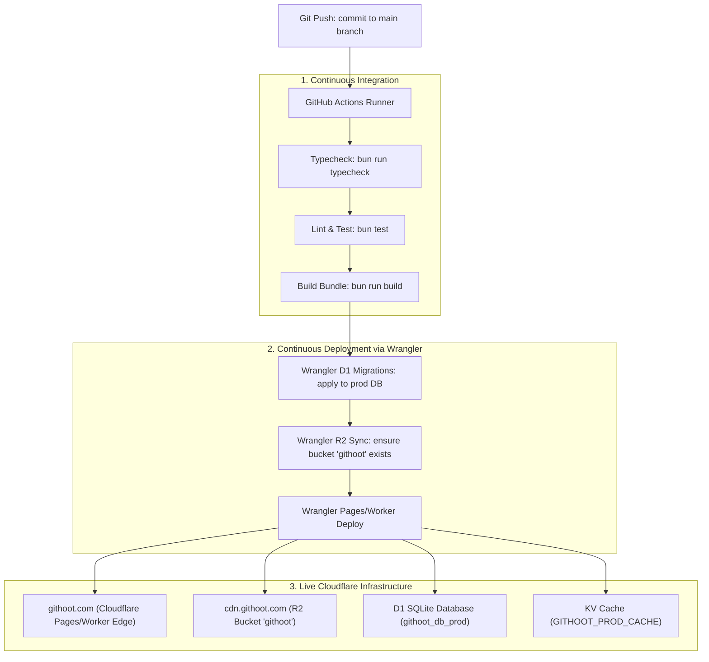

# Phase 7: Deployment, Infrastructure CI/CD & Cloudflare Setup

## Overview

Thiết lập toàn bộ quy trình tự động hóa triển khai (CI/CD Pipeline) lên **Cloudflare** thông qua **GitHub Actions** mỗi khi có sự kiện push vào nhánh `main`. Cấu hình tự động khởi tạo và kết nối **R2 Bucket `githoot`** (sử dụng các biến `R2_*` và `CLOUDFLARE_*` trong `.env`), chạy migrations cơ sở dữ liệu **D1**, cấu hình định tuyến DNS cho domain chính `githoot.com` và domain CDN tĩnh `cdn.githoot.com`, cùng hệ thống quản lý secrets bảo mật 100%.

## Requirements

### Functional
- **GitHub Actions Deployment Workflow (`.github/workflows/deploy.yml`):**
  - Kích hoạt tự động khi `push: branches: [main]` (hoặc chạy thủ công qua `workflow_dispatch`).
  - Kiểm tra linting, TypeScript type-check và unit tests trước khi build.
  - Tự động build client bundle và triển khai Cloudflare Pages / Workers thông qua `cloudflare/wrangler-action`.
- **Thiết lập R2 Storage Bucket `githoot`:**
  - Khởi tạo R2 bucket mới có tên `githoot` trên Cloudflare.
  - Cấu hình quyền truy cập công khai (Public Access) và gắn Custom Domain `cdn.githoot.com` để phân phối ảnh Pet, Egg spritesheets và assets tĩnh không tốn chi phí egress.
  - Sử dụng các thông số từ `.env`: `CLOUDFLARE_ACCOUNT_ID`, `CLOUDFLARE_API_TOKEN`, `R2_ACCESS_KEY_ID`, `R2_SECRET_ACCESS_KEY`, `R2_BUCKET_NAME=githoot`.
- **Cơ sở dữ liệu Cloudflare D1 Production:**
  - Tự động áp dụng migrations schema (`src/server/db/schema.sql`) lên D1 production database `githoot_db_prod`.
  - Khởi tạo sẵn 100 bản ghi Early Access slots (`early_access_slots`) nếu chưa tồn tại.
- **Cấu hình Domain & DNS Cloudflare (`githoot.com`):**
  - Trỏ DNS Apex domain `githoot.com` và `www.githoot.com` vào Cloudflare Pages deployment.
  - Trỏ CNAME `cdn.githoot.com` vào R2 Bucket `githoot`.
  - Bật SSL/TLS chế độ *Full (Strict)*, HTTP/3, gRPC và bật Cloudflare WAF Security Level: Medium + Bot Fight Mode.
- **Quản lý Secrets & Biến môi trường:**
  - Cấu hình an toàn các secrets trên GitHub Repository Secrets & Cloudflare Workers Secrets:
    - `GEMINI_API_KEY` (Gemini Nano Banana 2 API)
    - `GITHUB_TOKENS` (Danh sách JSON các PATs / App Tokens xoay vòng)
    - `GITHUB_CLIENT_ID` & `GITHUB_CLIENT_SECRET` (GitHub OAuth App)
    - `AUTH_SECRET` (HMAC Signing secret)
    - `CLOUDFLARE_API_TOKEN` & `CLOUDFLARE_ACCOUNT_ID`
    - `R2_ACCESS_KEY_ID` & `R2_SECRET_ACCESS_KEY`

### Non-functional
- Thời gian chạy CI/CD từ lúc push code lên `main` đến khi live trên `githoot.com` < 90 giây.
- Zero-downtime deployment: Cloudflare Workers chuyển đổi phiên bản tức thì tại Edge toàn cầu.

## Architecture



## GitHub Actions Workflow Contract (`.github/workflows/deploy.yml`)

```yaml
name: Deploy GitHoot to Cloudflare Edge

on:
  push:
    branches:
      - main
  workflow_dispatch:

jobs:
  deploy:
    runs-on: ubuntu-latest
    name: Build, Migrate, Set Secrets & Deploy
    steps:
      - name: Checkout Code
        uses: actions/checkout@v4

      - name: Setup Bun
        uses: oven-sh/setup-bun@v2
        with:
          bun-version: latest

      - name: Install Dependencies
        run: bun install --frozen-lockfile

      - name: Typecheck & Lint
        run: |
          bun run typecheck
          bun run lint

      - name: Run Unit Tests
        run: bun test

      - name: Build Project
        run: bun run build
        env:
          NODE_ENV: production

      - name: Apply D1 Production Migrations
        uses: cloudflare/wrangler-action@v3
        with:
          apiToken: ${{ secrets.CLOUDFLARE_API_TOKEN }}
          accountId: ${{ secrets.CLOUDFLARE_ACCOUNT_ID }}
          command: d1 migrations apply githoot_db_prod --remote

      - name: Deploy to Cloudflare Pages
        uses: cloudflare/wrangler-action@v3
        with:
          apiToken: ${{ secrets.CLOUDFLARE_API_TOKEN }}
          accountId: ${{ secrets.CLOUDFLARE_ACCOUNT_ID }}
          command: pages deploy dist --project-name=githoot

      - name: Upload Encrypted Runtime Secrets to Cloudflare Pages
        uses: cloudflare/wrangler-action@v3
        with:
          apiToken: ${{ secrets.CLOUDFLARE_API_TOKEN }}
          accountId: ${{ secrets.CLOUDFLARE_ACCOUNT_ID }}
          command: |
            echo "${{ secrets.GEMINI_API_KEY }}" | npx wrangler pages secret put GEMINI_API_KEY --project-name=githoot
            echo "${{ secrets.GITHUB_TOKENS }}" | npx wrangler pages secret put GITHUB_TOKENS --project-name=githoot
            echo "${{ secrets.GITHUB_CLIENT_ID }}" | npx wrangler pages secret put GITHUB_CLIENT_ID --project-name=githoot
            echo "${{ secrets.GITHUB_CLIENT_SECRET }}" | npx wrangler pages secret put GITHUB_CLIENT_SECRET --project-name=githoot
            echo "${{ secrets.AUTH_SECRET }}" | npx wrangler pages secret put AUTH_SECRET --project-name=githoot
            echo "${{ secrets.R2_ACCESS_KEY_ID }}" | npx wrangler pages secret put R2_ACCESS_KEY_ID --project-name=githoot
            echo "${{ secrets.R2_SECRET_ACCESS_KEY }}" | npx wrangler pages secret put R2_SECRET_ACCESS_KEY --project-name=githoot
```

## Related Code Files

- Create: `.github/workflows/deploy.yml` (GitHub Actions CI/CD workflow)
- Create: `scripts/setup-cloudflare-resources.ts` (CLI utility to bootstrap R2 bucket `githoot`, D1 DB, and KV namespaces)
- Modify: `wrangler.toml` (Cấu hình production environment bindings)

## Implementation Steps

1. **Viết Script Khởi tạo Tài nguyên Cloudflare (`setup-cloudflare-resources.ts`):**
   - Đọc các biến `CLOUDFLARE_*` và `R2_*` từ `.env`.
   - Gọi Cloudflare REST API tạo R2 bucket `githoot` nếu chưa có:
     `PUT https://api.cloudflare.com/client/v4/accounts/{account_id}/r2/buckets/githoot`.
   - Kết nối custom domain `cdn.githoot.com` vào bucket `githoot`.
2. **Cấu hình `wrangler.toml` cho Môi trường Production:**
   - Khai báo D1 database id, R2 bucket `githoot`, KV namespace id và Cloudflare Queue.
3. **Tạo GitHub Actions Workflow (`deploy.yml`):**
   - Cấu hình các bước kiểm tra chất lượng mã nguồn, chạy migration D1, deploy bundle và **tự động upload các runtime secrets được mã hóa** lên Cloudflare Pages Functions qua `wrangler pages secret put`.
4. **Cấu hình Secrets trên GitHub Repository:**
   - Nạp các giá trị từ `.env` vào GitHub Repository Secrets (`Settings > Secrets and variables > Actions`) để workflow sử dụng khi chạy CI/CD.

## Success Criteria

- [ ] Khi tạo commit và push vào nhánh `main`, GitHub Actions tự động kích hoạt và hoàn tất deploy thành công.
- [ ] R2 Bucket `githoot` được tạo và truy cập công khai qua `https://cdn.githoot.com/...`.
- [ ] D1 database production được migrate đầy đủ bảng và 100 slots Early Access.
- [ ] Domain `https://githoot.com` mở trực tiếp trên trình duyệt với chứng chỉ SSL/TLS hợp lệ và phản hồi < 150ms.

## Risk Assessment

| Rủi ro | Tín hiệu nhận biết | Phương án xử lý |
|---|---|---|
| **D1 migration bị xung đột khi deploy** | GitHub Actions fail tại bước `d1 migrations apply` | Sử dụng schema migrations có đánh số thứ tự (`0001_initial.sql`, `0002_...`) và chạy lệnh kiểm thử trên preview DB trước. |
| **Lỗi quyền API Token Cloudflare** | Wrangler báo lỗi 403 `Unauthorized` | Đảm bảo API Token có đủ các quyền: *Cloudflare Pages (Edit), D1 (Edit), R2 (Edit), Workers KV (Edit), Zone (Read)*. |
