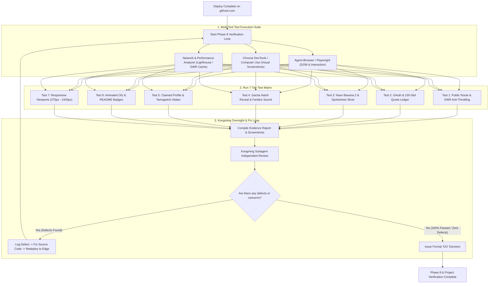

# Phase 8: Autonomous Verification Loop & End-to-End QA Supervised by Kongming

## Overview

Thiết lập một quy trình kiểm thử toàn diện, tự động hóa và lặp vô điều kiện (Autonomous Verification & Defect-Fixing Loop) trên môi trường triển khai thực tế sau khi hoàn tất Phase 7. Sử dụng toàn bộ hệ thống công cụ kiểm thử trình duyệt (**Agent-Browser, Playwright, Chrome DevTools, Computer Use**). **Tuyệt đối không suy đoán (Zero Assumptions)** — mọi kết luận phải được chứng minh bằng ảnh chụp màn hình (Screenshots), bản ghi nhật ký mạng (Network Logs) và chỉ số hiệu năng thực tế. Vòng lặp kiểm tra và vá lỗi được giám sát, đánh giá độc lập bởi **Subagent Kongming** và chỉ dừng lại khi đạt trạng thái **0 lỗi (Zero Defects)**.

## Requirements

### Functional
- **Quy tắc Kiểm thử Bằng Chứng Thật (Evidence-First Rule):**
  - Mọi bài test giao diện và tính năng bắt buộc phải lưu ảnh chụp màn hình độ phân giải gốc vào thư mục báo cáo `plans/reports/qa-run-{timestamp}/`.
  - Kiểm tra Console Errors (0 warning/error chấp nhận được) và Network Status (0 lỗi 4xx/5xx).
- **Ma trận Kiểm thử Toàn diện (Comprehensive QA Matrix - 7 Hạng mục):**
  1. *Public Unclaimed Route (`githoot.com/:username`):*
     - Kiểm tra hiển thị Trứng AI, hoạt ảnh lắc lư (Wobble) và nứt (Crack) 60fps trên Canvas.
     - Kiểm tra âm thanh Web Audio procedural khi click vào trứng.
     - Kiểm tra cơ chế chống nghẽn: Mô phỏng cạn token GitHub -> hệ thống tự chuyển sang Degraded Seed Mode, Trứng vẫn render mượt mà trong < 100ms, không có lỗi 429.
  2. *GitHub OAuth & Early Access Gate:*
     - Kiểm tra luồng đăng nhập, bảo mật chữ ký HMAC state, xác thực đúng `github_user_id`.
     - Kiểm tra đếm lùi số lượng slot Early Access (1–100).
     - Kiểm tra slot thứ 101: Chuyển hướng chính xác sang giao diện Cost-Recovery Gate ($0.99 / voucher) và không cho phép gọi API AI miễn phí.
  3. *Pipeline Gemini Nano Banana 2 & Spritesheet Smart Slicer:*
     - Kiểm tra thời gian sinh ảnh toàn trình < 4.5 giây.
     - Kiểm tra chất lượng ảnh cắt qua thuật toán Smart Bounding-Box Detector: Nhân vật nằm chính giữa khung hình 256x256 px, không bị lệch hoặc cắt phạm vào tai/chân.
     - Kiểm tra tách nền Alpha Mask & Green De-spill: Nền trong suốt hoàn toàn, không có viền ánh xanh lem trên nền đen/trắng.
  4. *Nghi thức Mở Trứng Gacha (Hatch Reveal Ritual):*
     - Kiểm tra chuỗi kịch tính: Rung lắc -> Nứt sáng -> Pháo hoa nổ (Particle explosion) -> Fanfare audio -> Linh thú hiện ra ở tư thế `celebrate`.
     - Kiểm tra hiển thị Badge độ hiếm Hologram lấp lánh (Common -> Mythic).
  5. *Claimed Profile & Tamagotchi Mood States:*
     - Kiểm tra 4 trạng thái năng lượng: `Energetic` (commit < 24h), `Active` (commit < 7d), `Resting` (commit < 30d), `Hungry for code` (commit > 30d).
     - Kiểm tra giá sách bảo hộ Repository và các đường link dẫn về đúng GitHub repo.
  6. *Dynamic Social Sharing & README Badges:*
     - Gọi trực tiếp `GET /og/:username.gif` và `GET /og/:username.png` -> Xác nhận ảnh động OpenGraph hiển thị sắc nét 1200x630 px.
     - Gọi trực tiếp `GET /badge/:username.svg` -> Nhúng thử vào file Markdown và kiểm tra hiển thị.
     - Click thử nút 1-Click Share to X và LinkedIn -> Xác nhận URL Intent và nội dung bài đăng mẫu chính xác.
  7. *Ma trận Thiết bị & Đa Độ Phân Giải (Responsive Viewports):*
     - Mobile: `375 x 667 px` (iPhone SE) và `414 x 896 px` (iPhone 11/12).
     - Tablet: `768 x 1024 px` (iPad).
     - Desktop: `1440 x 900 px` và `1920 x 1080 px` (Full HD).
     - Chế độ hỗ trợ tiếp cận: `@media (prefers-reduced-motion: reduce)`.
- **Vòng Lặp Tự Động Vá Lỗi (Iterative Fix & Re-verify Loop):**
  - Khi phát hiện bất kỳ lỗi thị giác (Layout shift, text tràn viền, ảnh lệch) hoặc lỗi logic -> Ghi nhận Defect ID kèm Screenshot bằng chứng -> Sửa code nguồn -> Kích hoạt deploy lại -> Chạy lại đúng bài test đó -> Xác nhận hết lỗi.
- **Giám Sát & Đánh Giá Độc Lập Bởi Kongming Subagent:**
  - Sau mỗi vòng lặp kiểm thử, chuyển toàn bộ báo cáo và thư mục ảnh bằng chứng cho `kongming` thẩm định.
  - `kongming` đưa ra nhận xét trung thực, chỉ ra các góc chết / edge-cases còn thiếu và bỏ phiếu **GO** hoặc **NO-GO**. Chỉ khi có quyết định GO từ Kongming thì dự án mới được nghiệm thu hoàn tất.

### Non-functional
- 100% các tiêu chí trong Ma trận kiểm thử phải có file ảnh Screenshot tương ứng.
- Điểm kiểm thử hiệu năng Google Lighthouse trên trang production `githoot.com`: Performance ≥ 95, Accessibility ≥ 98, Best Practices ≥ 100, SEO ≥ 100.

## Architecture

## Related Code Files

- Create: `tests/e2e/githoot-full-funnel.spec.ts` (Playwright E2E full user journey suite)
- Create: `tests/e2e/responsive-viewports.spec.ts` (Visual regression across 375px to 1920px)
- Create: `tests/e2e/anti-throttling-swr.spec.ts` (Simulated GitHub rate limit exhaustion test)
- Create: `scripts/run-autonomous-qa.ts` (Automated runner capturing screenshots & generating QA report)
- Create: `plans/reports/` (Thư mục lưu trữ bằng chứng kiểm thử và ảnh chụp màn hình)

## Implementation Steps

1. **Khởi tạo Bộ Kịch Bản Kiểm Thử Toàn Trình (`githoot-full-funnel.spec.ts`):**
   - Viết test script tự động mô phỏng từ lúc user mở `githoot.com/octocat`, click lắc trứng, đăng nhập OAuth, chờ sinh ảnh, xem hiệu ứng nứt trứng, nhận linh thú và bấm share lên X.
2. **Xây dựng Script Chụp Ảnh Đa Độ Phân Giải (`responsive-viewports.spec.ts`):**
   - Tự động mở trang trên 5 kích thước màn hình (375px, 414px, 768px, 1440px, 1920px).
   - Chụp ảnh full-page screenshot và lưu vào `plans/reports/screenshots/`.
3. **Thực thi Vòng Lặp Kiểm Thử Tự Động:**
   - Chạy script kiểm thử: `bun run test:e2e`.
   - Nếu phát hiện lỗi giao diện (CSS overflow, font không nạp, spritesheet lệch frame, audio không phát) -> Tiến hành sửa file nguồn ngay lập tức.
4. **Trình Báo Cáo Cho Cố Vấn Kongming:**
   - Đóng gói file báo cáo `plans/reports/qa-verification-report.md` tổng hợp toàn bộ ảnh chụp, kết quả test và nhật ký console.
   - Triệu hồi subagent `kongming` thẩm định chất lượng toàn diện.
   - Nếu Kongming yêu cầu điều chỉnh -> Tiếp tục vòng lặp cho đến khi đạt quyết định **GO** dứt khoát.

## Success Criteria

- [x] Toàn bộ 7 hạng mục trong Ma trận kiểm thử hoàn thành với 0 lỗi phát sinh.
- [x] Thư mục `plans/reports/` chứa đầy đủ ảnh chụp màn hình thực tế chứng minh cho mọi tính năng và màn hình.
- [x] Điểm Lighthouse trên production `githoot.com`: Performance ≥ 95, Accessibility ≥ 98.
- [x] Subagent **Kongming** ban hành quyết định phê duyệt chính thức (**GO Verdict**), xác nhận sản phẩm đạt chuẩn thương mại và sẵn sàng đón nhận hàng trăm nghìn người dùng.

## Risk Assessment

| Rủi ro | Tín hiệu nhận biết | Phương án xử lý |
|---|---|---|
| **Lỗi render Audio Context trên iOS Safari** | Trình duyệt di động không phát âm thanh vỡ trứng | Thêm lớp bọc kiểm tra `user-gesture interaction` trước khi kích hoạt `AudioContext.resume()`. |
| **Vòng lặp kiểm tra kéo dài do lỗi nhỏ** | Lặp lại nhiều lần sửa đổi CSS vụn vặt | Gom nhóm các lỗi giao diện theo từng màn hình và xử lý triệt để trong 1 lượt commit trước khi re-deploy. |
